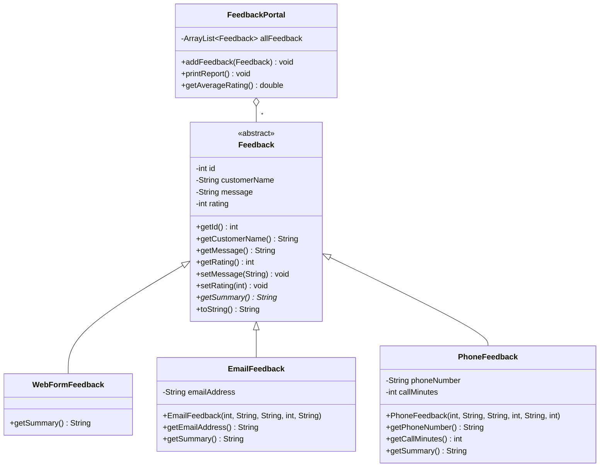

# UML Diagram

```mermaid
classDiagram
    class FeedbackPortal {
        -ArrayList~Feedback~ allFeedback
        +addFeedback(Feedback) void
        +printReport() void
        +getAverageRating() double
    }

    class Feedback {
        <<abstract>>
        -int id
        -String customerName
        -String message
        -int rating
        +getId() int
        +getCustomerName() String
        +getMessage() String
        +getRating() int
        +setMessage(String) void
        +setRating(int) void
        +getSummary() String*
        +toString() String
    }

    class WebFormFeedback {
        +getSummary() String
    }

    class EmailFeedback {
        -String emailAddress
        +EmailFeedback(int, String, String, int, String)
        +getEmailAddress() String
        +getSummary() String
    }

    class PhoneFeedback {
        -String phoneNumber
        -int callMinutes
        +PhoneFeedback(int, String, String, int, String, int)
        +getPhoneNumber() String
        +getCallMinutes() int
        +getSummary() String
    }

    Feedback <|-- WebFormFeedback
    Feedback <|-- EmailFeedback
    Feedback <|-- PhoneFeedback
    FeedbackPortal o-- "*" Feedback
```
