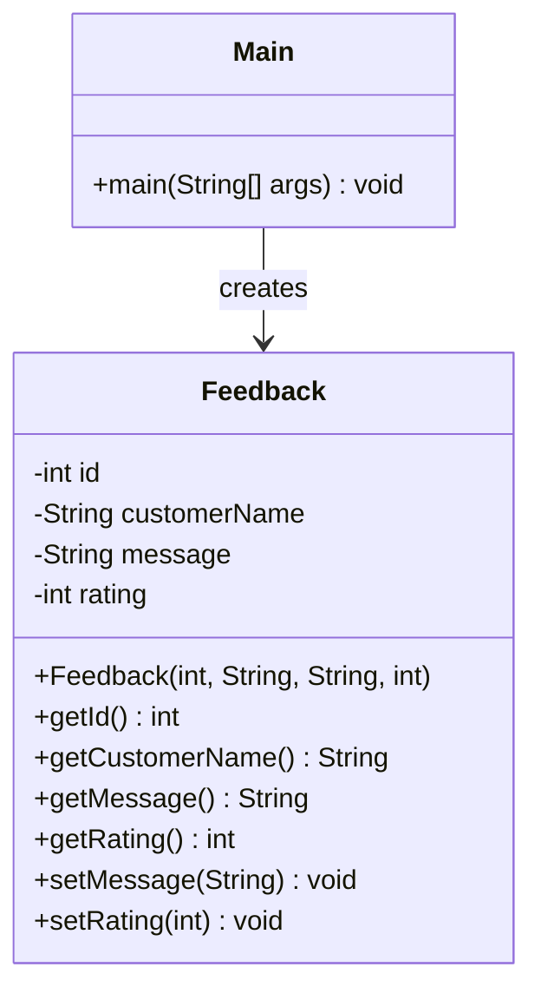

```mermaid
classDiagram
    class Feedback {
        -int id
        -String customerName
        -String message
        -int rating
        +Feedback(int, String, String, int)
        +getId() int
        +getCustomerName() String
        +getMessage() String
        +getRating() int
        +setMessage(String) void
        +setRating(int) void
    }

    class Main {
        +main(String[] args) void
    }

    Main --> Feedback : creates
```
